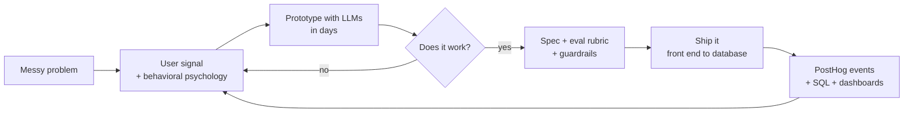

<div align="center">



<br/>


**AI Engineer. Full Stack Product Builder. Ships the whole thing.**

Model, backend, front end, evals, analytics. Then the PRD, because I know what to build and why.

[Site](https://devarshwali.com) · [LinkedIn](https://linkedin.com/in/devarshwali) · [Email](mailto:devarshwali@gmail.com)

</div>

---

## `package.json` for a human

```json
{
  "name": "devarsh-wali",
  "alias": "dev",
  "version": "6.0.0",
  "description": "AI engineer who builds full stack products end to end, product sense included",
  "title": "AI Engineer (Full Stack Product Builder)",
  "location": "USA (India roots, bilingual, both feel like home)",
  "education": "MS Engineering Management, UMBC",
  "domains": ["EdTech", "FinTech", "HealthTech", "PropTech"],
  "scale": ["early-stage startups", "unicorn", "Fortune 500"],
  "scripts": {
    "idea": "prototype it with an LLM before the meeting",
    "validate": "put it in front of real users, fast",
    "ship": "spec -> code -> evals -> metrics -> repeat"
  },
  "engines": { "caffeine": ">=2 cups", "curiosity": "unbounded" },
  "license": "open to great problems"
}
```

## How I work

I do not hand off a doc and wait. I build the first version myself, end to end, then harden it with evals, guardrails, and real usage data.



## The AI-era toolkit

| Layer | What I use it for |
|---|---|
| **LLM apps** | OpenAI, Azure AI, Claude, prompt design, structured outputs |
| **RAG and evals** | Retrieval pipelines, eval rubrics, guardrails, hallucination tracking |
| **Voice and agents** | ElevenLabs voice assistants, multi-agent workflows, agentic job-search automation |
| **AI-assisted building** | Claude Code and LLM pair programming to go from spec to working app fast |
| **Learning data** | xAPI, LMS integration, learner analytics |
| **Product analytics** | PostHog event design, SQL, Tableau, MicroStrategy, Snowflake |

## The full-stack toolkit

<div align="center">


</div>

## Receipts

Numbers from real work, not vibes.

| Result | Where |
|---|---|
| **35K+** monthly users on one AI-powered literacy product | K-12 EdTech, 10+ school districts |
| **12% to 2%** chatbot hallucination rate | RAG eval rubrics and guardrails |
| **MVP in 3 weeks** | Built with the CEO and CTO |
| **95%** adoption across launched districts | PostHog event requirements and rollout |
| **$1.5M** TAM identified | Market sizing for the product |
| **20+** mobile-responsive dashboards | MicroStrategy, for school and district stakeholders |
| **3rd place + seed funding** | Muvely, HealthTech MVP, 60+ teams, led a team of 3 |

## Things I built

**[AppliFirst](https://github.com/devarshwali/applifirst)**
A full-stack job application tool. React and TypeScript front end, Express and Drizzle on PostgreSQL, a Chrome extension, Google OAuth, Gmail API, and OpenAI in the loop.

**Job search automation**
An agentic Node.js system that finds roles and handles applications end to end.

**Voice assistant for simulations**
A voice and video assistant on the ElevenLabs API for classroom simulation activities.

**Pulse**
A content intelligence platform.

**DevVerse: Arcane Hustle**
A game. Because product taste also comes from building things that are just fun.

**Agentarium**
A playful AI office where you customize agents through UI settings and hand them tasks. Currently in progress.

## Product opinions I ship with

1. Prototype beats slide deck. A working demo ends most debates in five minutes.
2. If you cannot evaluate the model, you do not have a feature yet.
3. Behavior beats opinions. Watch what users do, not what they say.
4. Regulated systems are a design constraint, not an excuse to go slow.
5. Good copy is a feature. Short. Direct. No corporate voice.
6. Instrument first, then argue.

## Currently

- Building Agentarium and a voice-based AI mock interview app
- Looking for AI engineer and full stack product builder roles
- Sharpening the loop: idea, prototype, eval, ship

<details>
<summary><b>Side quest (click)</b></summary>

<br/>

I also do magic and mentalism. It taught me more about user attention and expectation than any framework did. A good product and a good trick share one rule: the audience should never feel the friction.

Pick a card. Any card. Now go read the [AppliFirst repo](https://github.com/devarshwali/applifirst).

</details>

## Credentials


---

<div align="center">

`while (alive) { learn(); build(); ship(); }`

</div>
